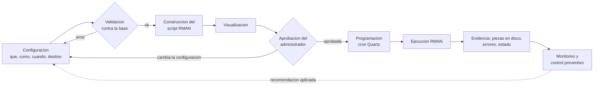
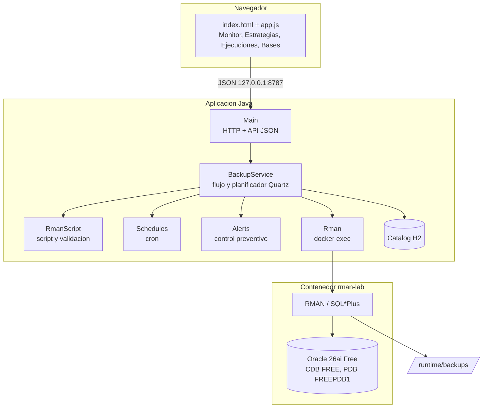
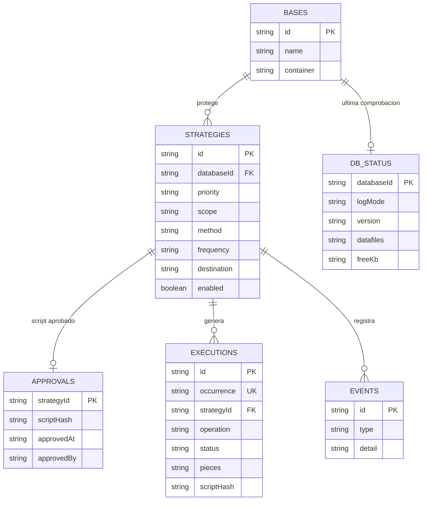
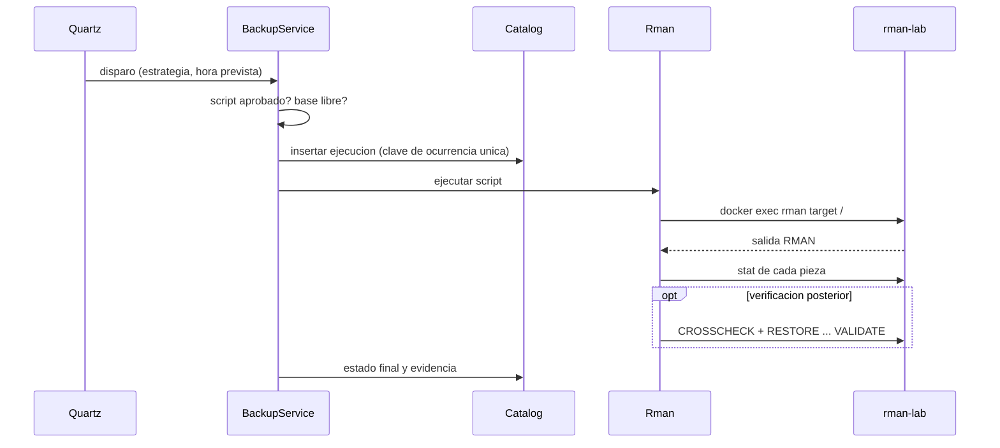

# Analisis y diseno

Contenido de los entregables 1 (documento de analisis) y 2 (diseno de la
aplicacion) del enunciado. Describe lo que el prototipo implementa. El grupo debe
revisarlo y pasarlo al formato de entrega que pida el profesor.

Indice: problema y riesgos, justificacion, objetivos, requerimientos, criterios de
prioridad, tipos de respaldo, ARCHIVELOG/NOARCHIVELOG, transformacion a RMAN,
controles preventivos, arquitectura, modelo de datos, secuencia de ejecucion,
diseno de interfaz y limitaciones.

## Problema y riesgos

Un respaldo manual depende de que alguien recuerde ejecutarlo, elija bien que
copiar y revise el resultado. Cualquier olvido se descubre cuando ya hace falta
restaurar. La herramienta convierte la politica de respaldo en un proceso
planificado, automatizado y verificable.

- Riesgo de disponibilidad: que la base o la informacion no esten disponibles
  cuando la operacion las necesita (perdida de un datafile, del control file,
  del servidor).
- Riesgo de integridad: perdida, corrupcion o alteracion que impida volver a un
  estado correcto (bloques corruptos, respaldos ilegibles, cadena de redo
  incompleta).

## Justificacion

La perdida de datos rara vez se debe a que RMAN no sepa respaldar. Casi siempre es
una falla del proceso: el respaldo no se programo, fallo sin que nadie lo viera,
se guardo donde no habia espacio o nunca se probo que se pudiera restaurar. Un
control preventivo actua antes de la perdida. Para eso la politica de respaldo
tiene que estar escrita (que, como, cuando), ejecutarse sola y dejar evidencia
verificable. La herramienta es ese control; RMAN sigue siendo el mecanismo que
copia y restaura.

## Objetivos

General: desarrollar una herramienta que permita definir, automatizar y monitorear
estrategias de respaldo de bases Oracle con RMAN, como control preventivo de los
riesgos de disponibilidad e integridad.

Especificos:

1. Modelar una estrategia con los componentes que, como, cuando y destino, y su
   prioridad.
2. Transformar la estrategia en un script RMAN validado contra el estado real de
   la base, que el administrador revisa y aprueba.
3. Ejecutar automaticamente las estrategias aprobadas segun su programacion.
4. Registrar evidencia de cada ejecucion y distinguir exitoso, con advertencias y
   fallido.
5. Detectar condiciones que comprometen la estrategia y emitir alertas,
   advertencias y recomendaciones.
6. Comprobar la recuperabilidad de los respaldos con mecanismos de RMAN y con una
   prueba de recuperacion en el laboratorio.

## Requerimientos

Funcionales:

| Id | Requerimiento |
| --- | --- |
| RF01 | Registrar bases de datos (nombre y contenedor) y comprobar su estado: version, modo de archivado, PDBs, datafiles, archived logs y espacio en los destinos |
| RF02 | Crear, editar y eliminar estrategias con nombre, descripcion, base, responsable, prioridad y estado activa/inactiva |
| RF03 | Seleccionar que respaldar: base completa, tablespaces, datafiles o solo componentes; archived redo logs, control file y SPFILE |
| RF04 | Seleccionar como respaldar: completo, incremental nivel 0, nivel 1 diferencial o acumulativo; compresion; verificacion posterior |
| RF05 | Definir cuando: fecha de inicio, frecuencia diaria, semanal o por intervalo, dias, horas y ventana de respaldo |
| RF06 | Definir el destino y mostrar el espacio disponible |
| RF07 | Generar y mostrar el script RMAN y validar la configuracion antes de aprobarla |
| RF08 | Aprobar el script; invalidar la aprobacion si la configuracion cambia |
| RF09 | Programar y ejecutar automaticamente las estrategias aprobadas; permitir la ejecucion manual |
| RF10 | Registrar la evidencia de cada ejecucion (seccion 10 del enunciado) y consultar el historial |
| RF11 | Verificar respaldos con CROSSCHECK y RESTORE ... VALIDATE |
| RF12 | Detectar las condiciones de la seccion 11 y mostrarlas con su nivel y su accion |
| RF13 | Aplicar una recomendacion solo por decision del administrador |
| RF14 | Registrar en una bitacora las acciones del administrador |

No funcionales:

| Id | Requerimiento |
| --- | --- |
| RNF01 | Seguridad: en modo real el servidor solo acepta conexiones de 127.0.0.1 y valida Host y Origin. Los valores del usuario se validan antes de entrar a un script |
| RNF02 | Confiabilidad: no se ejecutan dos respaldos a la vez sobre la misma base; una ejecucion sin cierre confirmado bloquea la base hasta que el administrador la libere |
| RNF03 | Trazabilidad: cada ejecucion guarda el script exacto, su huella y la salida de RMAN |
| RNF04 | Portabilidad: el entorno se prepara con un solo script (Windows, macOS o Linux) y se compila con el Maven Wrapper y Java 21+ |
| RNF05 | Usabilidad: interfaz en espanol; los estados se distinguen por forma, icono y texto, no solo por color; funciona en pantallas de telefono |
| RNF06 | Mantenibilidad: la construccion del script, los horarios y las alertas son funciones puras con pruebas automatizadas |

## Criterios de prioridad

La prioridad se asigna a la informacion, no al respaldo. El criterio del grupo es
el tiempo maximo que la organizacion acepta sin un respaldo correcto de esos datos.

| Prioridad | Descripcion | Se asigna cuando... | Antiguedad maxima del ultimo respaldo correcto |
| --- | --- | --- | --- |
| Alta | Critica para la continuidad de la operacion | Su perdida detiene procesos del negocio o no se puede reconstruir | 24 h |
| Media | Importante; admite mayores tiempos de recuperacion | Su perdida afecta procesos, pero existe un respaldo parcial o una fuente alternativa | 72 h |
| Baja | Menor impacto o reconstruible | Se puede regenerar a partir de otros datos o scripts | 168 h (7 dias) |

La herramienta aplica el criterio de dos formas:

- Al disenar: si la programacion deja mas horas entre respaldos que el objetivo,
  advierte "frecuencia insuficiente".
- Al operar: si el ultimo respaldo correcto supera el objetivo, genera la alerta
  "sin respaldo reciente".

Los valores estan en Models.rpoHours y pueden ajustarse si el grupo justifica otros.

## Tipos de respaldo

| Criterio | Completo (FULL) | Incremental nivel 0 | Nivel 1 diferencial | Nivel 1 acumulativo |
| --- | --- | --- | --- | --- |
| Que copia | Todos los bloques usados | Todos los bloques usados | Bloques cambiados desde el ultimo nivel 0 o 1 | Bloques cambiados desde el ultimo nivel 0 |
| Espacio | Alto | Alto | Bajo | Crece cada dia hasta el siguiente nivel 0 |
| Tiempo de respaldo | Alto | Alto | Bajo | Bajo a medio |
| Frecuencia tipica | Semanal o puntual | Semanal | Diaria o varias veces al dia | Diaria |
| Volumen modificado | Irrelevante | Irrelevante | Adecuado si cambia poco | Adecuado si cambia poco o moderado |
| Complejidad de recuperacion | Baja: una pieza | Baja si se usa solo | Mayor: nivel 0 + todos los nivel 1 | Media: nivel 0 + el ultimo nivel 1 |
| Base de incrementales | No | Si | No aplica | No aplica |

Notas verificadas en el laboratorio:

- Un FULL no sirve de base para un nivel 1. Para una cadena incremental se
  programa un nivel 0.
- En Oracle 23ai, si se ejecuta un nivel 1 sin nivel 0, RMAN copia los bloques
  desde la creacion del datafile y lo registra como nivel 1. No falla. Por eso el
  monitor recomienda crear la estrategia de nivel 0.
- Cualquiera de los tipos solo permite volver al momento del respaldo. Para
  recuperar hasta un momento posterior se necesitan los archived redo logs.

## ARCHIVELOG y NOARCHIVELOG

| Aspecto | ARCHIVELOG | NOARCHIVELOG |
| --- | --- | --- |
| Redo en linea al llenarse | Se copia como archived redo log | Se sobrescribe |
| Respaldo con la base abierta | Si (en linea) | No: RMAN falla con ORA-19602; requiere la base en MOUNT |
| Recuperacion | Completa o hasta un punto en el tiempo | Solo hasta el ultimo respaldo consistente |
| Respaldo de archived logs | Necesario para aprovechar el modo | No existen |

Comportamiento de la herramienta (la herramienta nunca cambia el modo):

- Informativa: la base esta en ARCHIVELOG.
- Recomendacion: incorporar archived redo logs a una estrategia de datos que no
  los incluye. Tiene boton "Aplicar", que el administrador acciona.
- Advertencia: la base esta en NOARCHIVELOG (texto del enunciado), y un respaldo
  en linea de datafiles fallara.
- Error de validacion: una estrategia incluye archived logs en una base
  NOARCHIVELOG. Impide aprobarla.

## Transformacion de la estrategia en RMAN

| Parte de la estrategia | Instruccion generada |
| --- | --- |
| Destino y dispositivo | ALLOCATE CHANNEL d1 DEVICE TYPE DISK FORMAT '<destino>/%d_%T_%U.bkp' |
| Tipo y nivel | INCREMENTAL LEVEL 0 / LEVEL 1 / LEVEL 1 CUMULATIVE (nada para FULL) |
| Compresion | AS COMPRESSED BACKUPSET |
| Identificacion | TAG derivado del nombre (EST001_DATOS_DEL_LABORATORIO) |
| Base completa / tablespaces / datafiles | DATABASE / TABLESPACE PDB:TS, ... / DATAFILE 7, 13 |
| Archived redo logs | BACKUP ... ARCHIVELOG ALL NOT BACKED UP 1 TIMES, despues de los datos |
| Control file | BACKUP ... CURRENT CONTROLFILE, al final |
| SPFILE | BACKUP ... SPFILE |
| Verificacion | CROSSCHECK BACKUP TAG, RESTORE <alcance> VALIDATE, RESTORE CONTROLFILE/SPFILE/ARCHIVELOG ALL VALIDATE |
| Cuando | Expresiones cron de Quartz, por ejemplo "0 0 2 ? * SUN" o "0 30 0/4 ? * MON-FRI" |

Implementacion: RmanScript.backup, RmanScript.validate y Schedules.cron. La
aprobacion guarda la huella SHA-256 del script; cualquier cambio la invalida.

Flujo de construccion de una estrategia (seccion 8 del enunciado):

## Controles preventivos

| Condicion (seccion 11) | Nivel | Deteccion | Riesgo que reduce |
| --- | --- | --- | --- |
| Estrategia sin programacion | Advertencia | Sin horarios | Disponibilidad |
| Estrategia inactiva | Advertencia | Marcada inactiva | Disponibilidad |
| Respaldo programado que no se ejecuto | Alerta | Ocurrencias cron sin ejecucion registrada, o ejecuciones omitidas | Disponibilidad |
| Ejecucion fallida | Alerta | Ultima ejecucion fallida, con el error de RMAN | Disponibilidad e integridad |
| Falta de espacio | Advertencia | df en el destino frente al tamano de los datafiles del alcance | Disponibilidad |
| Ausencia de archived logs requeridos | Advertencia / error | Ninguna estrategia los respalda; se piden en NOARCHIVELOG; no hay disponibles | Integridad |
| Base en NOARCHIVELOG | Advertencia | v$database.log_mode | Integridad |
| Sin respaldo reciente | Alerta | Ultimo respaldo correcto mas antiguo que el objetivo de su prioridad | Disponibilidad |
| Configuracion incompleta | Advertencia / alerta | Sin responsable o descripcion; tablespace, datafile o destino inexistentes | Integridad |
| Adicionales | Varios | Script sin aprobar, frecuencia insuficiente, ventana excedida, nivel 1 sin nivel 0, respaldo sin verificar, ejecucion incierta | Ambos |

## Aporte de cada funcionalidad al control preventivo

| Funcionalidad | Aporte |
| --- | --- |
| Prioridad con objetivo en horas | Convierte la importancia de los datos en un umbral medible |
| Validacion contra la base | Evita programar scripts que fallarian (tablespace o destino inexistente) |
| Aprobacion con huella | Solo se ejecuta lo que el administrador reviso |
| Programacion automatica | Elimina la dependencia de ejecutar a mano |
| Comprobacion de piezas en disco | No confunde "RMAN termino" con "hay respaldo" |
| CROSSCHECK y RESTORE ... VALIDATE | Comprueba que el respaldo se puede leer y restaurar |
| Historial y bitacora | Evidencia auditable de que se hizo, cuando y quien lo aprobo |
| Alertas y recomendaciones | Avisan antes de que la falta de un respaldo se convierta en perdida de datos |

## Arquitectura y modulos

| Modulo | Responsabilidad |
| --- | --- |
| Main | Servidor HTTP, rutas /api, validacion de Host y Origin, eleccion del modo local o simulacion |
| BackupService | Flujo: validar, aprobar, programar, ejecutar, evaluar evidencia, liberar bases, aplicar recomendaciones |
| RmanScript | Construccion del script y validacion semantica (funcion pura) |
| Schedules | "Cuando" como expresiones cron de Quartz y calculo de ocurrencias |
| Alerts | Reglas del control preventivo (funcion pura) |
| Rman | docker exec de rman, sqlplus, stat y df; interpretacion de la salida |
| SimulatedRman y Demo | Sustituto sin Oracle y datos de ejemplo para la demostracion publica |
| Catalog | H2: bases, estrategias, aprobaciones, estado, ejecuciones y bitacora |

El contenedor rman-lab ejecuta Oracle AI Database 26ai Free (23.26) con RMAN;
/opt/oracle/backup esta montado en runtime/backups del proyecto.

## Modelo de datos

Cada tabla H2 guarda el registro completo en JSON y lo indexa por su clave.

| Tabla | Contenido |
| --- | --- |
| bases | Nombre y contenedor |
| strategies | Informacion general, que, como, cuando y destino |
| approvals | Huella del script aprobado, fecha y aprobador |
| db_status | Ultima comprobacion: version, modos, PDBs, datafiles, archived logs, espacio por destino |
| executions | Evidencia de cada ejecucion; la clave de ocurrencia evita duplicados |
| events | Bitacora de acciones |

## Secuencia de una ejecucion programada

## Diseno de la interfaz

| Vista | Contenido | Para que sirve |
| --- | --- | --- |
| Monitor | Indicadores, linea de tiempo de +-24 h, control preventivo, estado por estrategia, bases y bitacora | Saber de un vistazo si los datos estan protegidos y que hay que atender |
| Estrategias | Tabla con que, como, cuando y el ciclo de cada estrategia; acciones ejecutar, verificar, aprobar, editar y eliminar | Administrar las estrategias |
| Constructor | Cinco pasos (informacion general, que, como, cuando, destino) con el script y la validacion en vivo y el diagrama "como se recuperaria" | Construir la estrategia sin escribir RMAN |
| Revision y aprobacion | Flujo del enunciado, resumen, observaciones, script, huella y aprobador | Revisar antes de programar |
| Ejecuciones | Historial filtrable; evidencia con todos los campos de la seccion 10, script, registro RMAN y verificacion | Consultar y demostrar lo ocurrido |
| Bases de datos | Estado de cada base: version, modo, PDBs, tablespaces, datafiles, archived logs y espacio | Registrar y comprobar bases |

Decisiones de diseno:

- Los estados usan la paleta de estado (verde, ambar, naranja, rojo) junto con una
  forma (circulo, triangulo, rombo, cuadrado) y un texto, para que se lean sin
  depender del color.
- Las recomendaciones tienen un boton explicito; la herramienta no aplica cambios
  por su cuenta (enunciado 14.6).
- La linea de tiempo es la del pizarron de clase (T0, T1, T2...): un carril por
  estrategia con lo ocurrido y lo programado.

## Limitaciones conocidas

- La programacion vive en memoria (Quartz) y se reconstruye desde el catalogo al
  iniciar. Con la aplicacion cerrada no se ejecutan respaldos; se reportan como
  "no ejecutados".
- En el laboratorio los respaldos quedan en el mismo disco que la base: sirve para
  practicar, pero no protege contra una falla del disco.
- El criterio de prioridad se evalua por estrategia; no combina la cobertura de
  varias estrategias sobre los mismos datos.
- No gestiona retencion (DELETE OBSOLETE) ni cintas (SBT); el enunciado no los
  pide.
